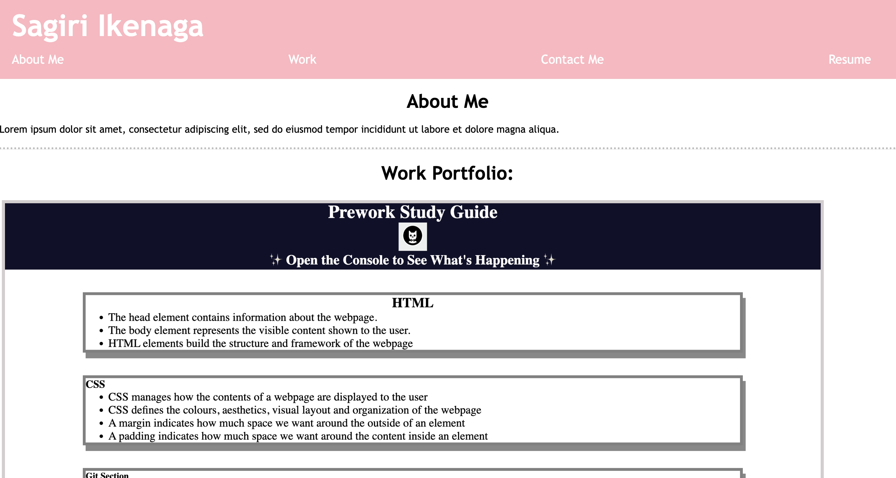

# Module 2 Challenge 

## Description

This project allowed for the application of HTML/CSS knowledge learned so far in order to create a portfolio webpage to showcase the work I have completed at this point in the course. This portfolio represents my capabilities as a junior web developer student. It allows for readers to understand my skill level and what I understand in terms of HTML and CSS. With this project, I learned how to create a basic webpage from scratch using elements such as flexbox, media queries, class/id selectors, and more. 

## Usage

This website allows for readers to access the work I've completed so far, by referencing the github repositories I've linked directly to the page. The code can also be used as a general layout for a portfolio page and to view which styles I incorporated and what code I included.

## Deployed Application

The live page is found at https://sagirikenaga.github.io/sagiri-ikenaga-portfolio/. 

## Demo

The webpage appears as the following:

## Credits

Sagiri Ikenaga
